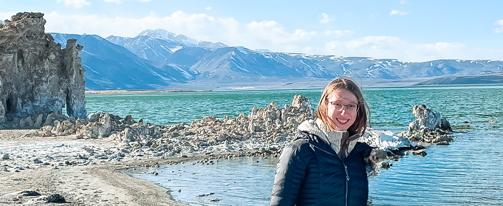

 

 

<h3>
About
</h3>

&nbsp;&nbsp;&nbsp;&nbsp;I am a PhD student working with Dr. Sidney Hemming and Dr. Stephen Cox in the [Argon Geochronology Lab for the Earth Sciences](https://ages.ldeo.columbia.edu/) at [Lamont-Doherty Earth Observatory](https://lamont.columbia.edu). I am fascinated by global fault zones and applying noble gas geochronology techniques to refine seismic histories and larger scale geologic evolutions. Using a variety of mineralogy and radiometric dating techniques, my research interests include the timing of slip along the central creeping section of the San Andreas Fault, the nature and timing of shallow tsunamigenic slip in the Japan Trench, and the extension and collapse of the Rio Grande Rift with associated economic mineralization.

&nbsp;&nbsp;&nbsp;&nbsp;Paragraph 2

&nbsp;&nbsp;&nbsp;&nbsp;I earned a BA in Environmental Biology and a BA in Computer Science with a focus on Intelligent Systems from Barnard College. During my undergraduate years, I participated in medical research studying [rare genetic causes of pediatric hearing loss](https://www.nature.com/articles/s41431-023-01302-2) and the [detection of SARS-CoV-2 in wastewater](https://journals.asm.org/doi/full/10.1128/spectrum.02929-22), computer science pedagogy for a [graduate level computer vision course](https://fpcv.cs.columbia.edu/Monographs), and geology research focused on [noble gas geochronology method development](https://lamont.columbia.edu/sites/default/files/content/Summer%20Interns%202022/Everard_Abstract.pdf) which evolved into my current research pursuits. 

 

<h3>
Recent News
</h3>

- Dr. Laura Guertin invited me to record [an episode for her podcast 'Tales From the Deep: Stories of Scientific Ocean Drilling](https://archive.storycorps.org/interviews/i-dont-think-younger-me-would-have-believed-i-would-have-the-opportunity-to-do-something-like-this-and-how-strong-of-a-community-it-is/). We had such a fun conversation! Check it out to hear about scientific drilling from the San Andreas Fault to the Japan Trench.
- I just got back from two months at sea as part of IODP Expedition 405: JTRACK where we were drilling through the fault zone off the coast of Japan. Lots more exciting content to come soon, but for now, check out this interview I did for the [Oral Histories of Scientific Ocean Drilling project](https://talesofoceanscience.com/jenna-everard/)

 

<small><i>The base for this website is [researcher](https://github.com/ankitsultana/researcher), by Ankit Sultana</small></i>

