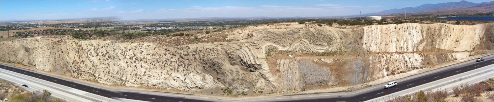
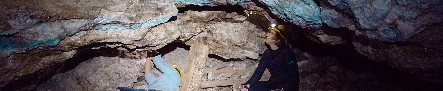
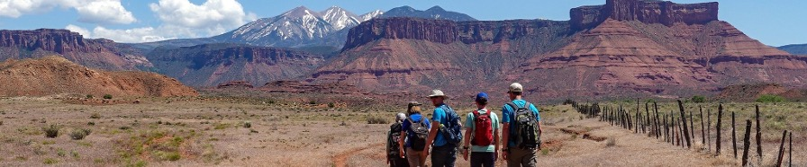
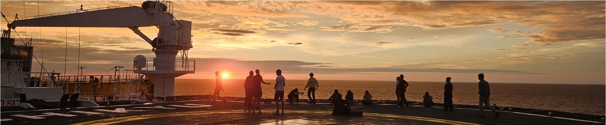
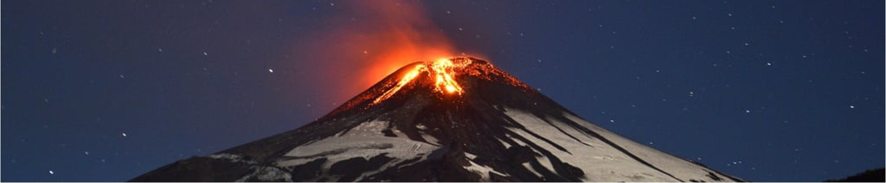
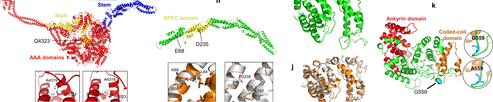
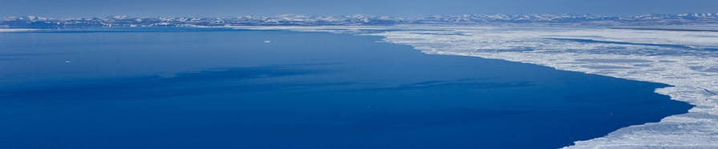

 

<h3>
Current Research
</h3>

 

<h4>
The San Andreas Fault Observatory at Depth
</h4>

&nbsp;&nbsp;&nbsp;&nbsp;Earthquakes pose significant hazards worldwide, yet many important fault zones are poorly characterized and their seismic histories unclear due to the long gaps between large earthquakes. One such major fault is the San Andreas Fault, a strike slip fault located along California's western coast. A unique opportunity to study its central section is the San Andreas Fault Observatory at Depth (SAFOD), a 3.2 km drillhole intercepting regions of seismicity at depth with near complete recovery of material from active fault strands. Although the northern and southern locked sections of the fault have hosted significant rupture, this central section is a creeping fault, a form not typically associated with large earthquakes. However, pilot work on SAFOD bulk samples suggests otherwise.

&nbsp;&nbsp;&nbsp;&nbsp;Radiometric dating is a powerful approach to calculate a sample age, informing detailed histories of deposition, fluid flow, and tectonics, such as those captured by SAFOD. A common chronometer is potassium-argon (K/Ar) dating, which uses a portion of the branched decay of radioactive K-40 into its noble gas daughter product Ar-40*. Commonly, the target is potassium-containing clays, as the elevated temperatures in the rupture reset their K/Ar ages by the formation of new minerals and the alteration of existing minerals. I aim to leverage clay mineralogy measurements in tandem with K/Ar ages to better assess the timing and risk of seismicity in the region.

 

<h4>
Fluorite Deposits Along the Rio Grande Rift
</h4>

&nbsp;&nbsp;&nbsp;&nbsp;The North American Cordillera, stretching the vast distance from Canada down through Mexico, was formed from a period of intense crustal compaction and orogenic events, followed by extension and orogenic collapse which created the topography we see today. Such zones of rifting and faulting are correlated with bands of mineralization of economically important ore, making them the focus areas for a variety of both researchers and professionals. However, the timing of and forces that drove such tectonics and related collapse remain a point of debate.

&nbsp;&nbsp;&nbsp;&nbsp;Within the North American Cordillera, I focus on one portion: that of the Rio Grande Rift within Central and Eastern New Mexico. An area of significant past mining, historic records indicate the common occurrence of mineralized veins of fluorite and galena along northeast trending faults. Thus, I trace fluorite deposits across New Mexico in order to determine the timing and source of the fluids which precipitated them. Data collected will be fed into models to establish a more accurate understanding of the tectonic and volcanic history of North America.

 

<h4>
Neon Dating of Iron Oxides
</h4>

&nbsp;&nbsp;&nbsp;&nbsp;(U-Th)/He dating measures the helium atoms produced during the decay of uranium and thorium in order to calculate a sample age; however, helium-4 is a lightweight noble gas that is known to leak out of mineral structures at very low temperatures. Thus, this approach likely records cooling ages rather than actual formation ages. If, instead, we can use neon-21, which is produced in oxide minerals as a result of this same decay series and is better retained in mineral structures, we can determine actual formation ages.

&nbsp;&nbsp;&nbsp;&nbsp;<b>Methodology:</b> I designed and built a custom extraction line for a new mass spectrometer setup that will be able to measure neon isotope concentrations. Currently, I am working to tune and standardize the instrument.

&nbsp;&nbsp;&nbsp;&nbsp;<b>Application 1:</b> The Great Unconformity represents approximately a billion years of missing geologic record, yet the timing of the erosion that formed the Great Unconformity remains unclear, as is the process(es) that caused it. Stratigraphically associated with the formation of the Great Unconformity, the Tavakaiv sandstone injectites in Colorado provide an opportunity for constraining the history of erosion in the region. I will apply (U-Th)/Ne dating to hematite veins in these injectites in order to refine the nature and timing of erosion below the Great Unconformity.

&nbsp;&nbsp;&nbsp;&nbsp;<b>Application 2:</b> The Paradox Basin is a Paleozoic Basin in the Southwestern United States that holds geologic, hydrologic, and economic importance. As such, it is desirable to understand the history of the Paradox Basin in terms of geologic forcings, hydraulic fluxes, and fluid-flow reactions. I collected samples during field work in 2022 and aim to apply (U-Th)/Ne dating to better constrain the timing of mineralizing fluid flow in the region.

 

<h4>
Japan Trench Seismicity and Shallow Slip
</h4>

&nbsp;&nbsp;&nbsp;&nbsp;In the Fall of 2024, I sailed on IODP Expedition 405 as an on-board sedimentologist. We drilled through the Japan Trench with the aim to recover core from the plate boundary fault, associated with the 2011 Tohoku-Oki earthquake. Post-cruise, I am using clay mineralogy and K/Ar dating techniques to refine seismic histories along the trench.

 

 

<h3>
Past Research
</h3>

 

<h4>
Temperature of the Villarrica Lava Lake
</h4>

&nbsp;&nbsp;&nbsp;&nbsp;Lava temperatures are often poorly constrained due to lack of data availability or field site accessibility. Such is the case with the Villarrica Lava Lake. To attempt to provide constraints, we subjected volcanic glass samples to a variety of temperature and oxygen fugacity conditions to recreate magmatic conditions. We then performed electron microprobe analyses to quantify resulting mineral phases.

 

<h4>
Internet Safety and Data Privacy
</h4>

&nbsp;&nbsp;&nbsp;&nbsp;In our increasingly networked world, privacy continues to face new threats despite its great value. Online tracking techniques have been around since the invention of the browser cookie in the early 1990’s, but the ever-increasing sophistication of these techniques have made them difficult to detect and even more difficult to deter. Between an observed lack of awareness and an apparent lack of regulative legislation, it is becoming clear that much work remains to be done to elucidate the implications of these technologies.

&nbsp;&nbsp;&nbsp;&nbsp;In this study, a combination of online user surveys and in-person interviews were conducted to analyze awareness, perspectives, and concerns surrounding these online tracking techniques. Results indicate that while the vast majority have some knowledge of tracking using browser cookies, this knowledge is both focused on negative connotations and limited in that it does not extend to other methods like supercookies or browser fingerprinting. Despite this, a general trend can be observed in a decrease in user comfort level with data being collected online as this data becomes more personal. Yet, while users are concerned for their privacy online, they feel as if their efforts, and that of privacy legislation, lack the ability to provide protection or prevent identification via means such as browser fingerprinting. Ultimately, resulting insights can be applied to direct the formation of a suite of educational resources and to propose an approach to legislative reform.

&nbsp;&nbsp;&nbsp;&nbsp;[Watch the mini-documentary here](https://jenna-everard.medium.com/tracked-without-a-trace-c4bf71efd60a)

 

<h4>
Wastewater Surveillance of SARS-CoV-2
</h4>

&nbsp;&nbsp;&nbsp;&nbsp;During the COVID-19 pandemic, part of Barnard College's public health response involved the daily surveillance of wastewater from all on-campus academic buildings and residence halls. Sewage testing is useful to detect levels of circulating viruses, and our efforts were able to detect when variants of concern began to spike. I was responsible for collecting sewage from each building and the compilation and organization of assay data.

 

<h4>
Pediatric Hearing Loss
</h4>

&nbsp;&nbsp;&nbsp;&nbsp;I filtered and compiled genomic variant data from study families and used pedigrees obtained from verbal interviews to identify rare genetic causes of pediatric hearing loss. To complement clinical results, I performed in silico RNA expression analyses for the inner ear.

 

<h4>
Arctic Ocean Microbiomes
</h4>

&nbsp;&nbsp;&nbsp;&nbsp;Microbes control the global carbon cycle in and out of the ocean. Therefore, meaningful climate change research involves the thorough analysis of ocean microbial communities. By isolating the 16S rRNA gene, a highly conserved gene with slow evolutionary change, bacterial taxa can be identified and subsequently tracked across time and space. Traditionally, a 16S rRNA sequencing process is carried out which involves polymerase chain reaction (PCR), a process which is subject to various errors, including primer bias, chimera formation, and abundance level misrepresentation. It is hypothesized that metagenomic sequencing, or the sequencing of all the genetic information rather than targeting a specific gene, and then utilizing computer algorithms to computationally identify sequences corresponding to the 16S rRNA gene, will provide more accurate population distributions. I examine what, if any, taxonomic differences result from these two approaches by analyzing two arctic metagenomes: one from the Bering Strait and the other from the Chukchi Sea.

 

<small><i>The base for this website is [researcher](https://github.com/ankitsultana/researcher), by Ankit Sultana</i>

 
